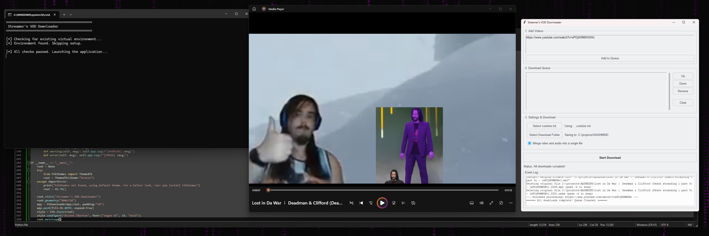

# Streamer's VOD Downloader

A simple, robust Python GUI application designed for content creators and streamers to reliably download their own VODs from YouTube in the highest possible quality.

This tool was born out of frustration with overly complex command-line tools and unreliable web downloaders. It provides a straightforward graphical interface built on the powerful `yt-dlp` engine, ensuring you can easily archive your content for editing or safekeeping.

## Features

*   **Maximum Quality Downloads**: Defaults to downloading the best available video (e.g., AV1/VP9) and best audio (e.g., Opus) as separate files, perfect for video editors.
*   **Optional Merging**: A simple checkbox lets you merge the video and audio streams into a single, high-quality MP4 file for easy playback.
*   **Simple GUI**: No command line needed. A clean and intuitive interface for managing your downloads.
*   **Download Queue**: Paste multiple URLs and add them to a queue to download sequentially.
*   **Playlist Support**: Paste a playlist URL, and the app will grab every video in it.
*   **Cookie Authentication**: Securely use your browser's `cookies.txt` file to download your own private, unlisted, or members-only videos.
*   **Portable Launcher**: Includes a Windows Batch file (`.bat`) that automatically creates a self-contained environment, making it easy to run from a flash drive without a complex setup.

## Requirements

*   Windows 10 / 11
*   [Python 3.9+](https://www.python.org/downloads/) (The installer from the Microsoft Store works perfectly).

## How to Use

This project includes a launcher that handles all the setup for you.

#### The Easy Way (Recommended)

1.  Download the repository files (`streamer_downloader.py` and `start_downloader.bat`) and place them in a folder.
2.  Double-click **`start_downloader.bat`**.
3.  The **first time** you run it, the script will automatically create a local Python environment (`venv`) and install the necessary packages (`yt-dlp`, `ttkthemes`). This may take a minute.
4.  On all future runs, the application will launch instantly.

#### The Manual Way (For Developers)

If you prefer to set up the environment yourself:
1.  Clone the repository: `git clone https://github.com/waefrebeorn/WuBu-DLP.git'
2.  Navigate into the directory: `cd WuBu-DLP`
3.  Create a virtual environment: `python -m venv venv`
4.  Activate it: `venv\Scripts\activate`
5.  Install the dependencies: `pip install yt-dlp ttkthemes`
6.  Run the application: `python streamer_downloader.py`

## The Files

*   **`streamer_downloader.py`**: The main Python script containing the Tkinter GUI application logic.
*   **`start_downloader.bat`**: The robust Windows launcher script. It checks for Python, creates a virtual environment, installs dependencies, and runs the app.

## License

This project is licensed under the MIT License. See the `LICENSE` file for details.